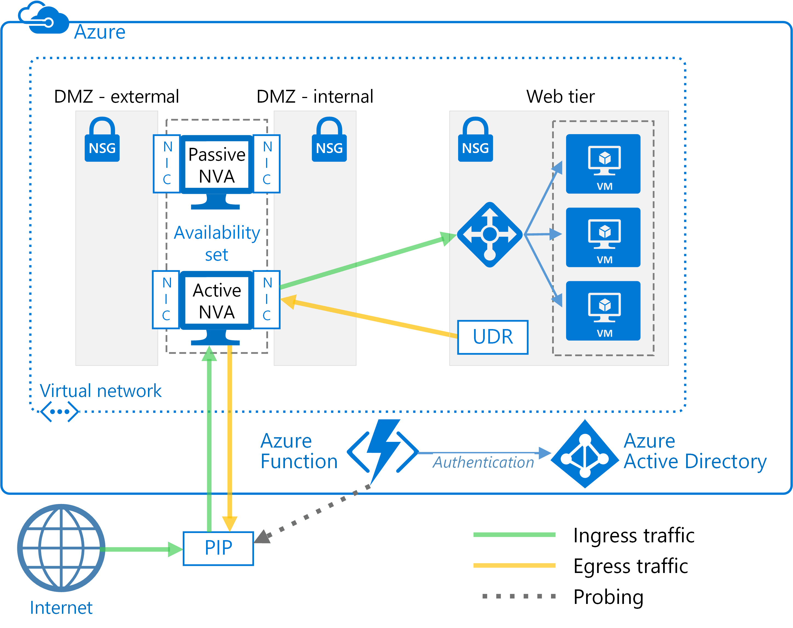

## PIP-UDR NVAs without SNAT

This architecture uses two Azure virtual machines to host the NVA firewall in an active-passive configuration that supports automated failover but does not require Source Network Address Translation (SNAT).

This solution is designed for Azure customers who cannot configure SNAT for inbound requests on their NVA firewalls. SNAT hides the original source client IP address. If you need to log the original IPs or used them within other layered security components behind your NVAs, this solution offers a basic approach.

The failover of UDR table entries is automated by a next-hop address set to the IP address of an interface on the active NVA firewall virtual machine. The automated failover logic is hosted in a function app that you create using [Azure Function](https://docs.microsoft.com/en-us/azure/azure-functions/). The failover code runs as a serverless function inside Azure Function—deployment is convenient, cost-effective, and easy to maintain and customize. In addition, the function app is hosted within Azure Function, so it has no dependencies on the virtual network. If changes to the virtual network impact the NVA firewalls, the function app continues to run independently. Testing is more accurate as well, because it takes place outside the virtual network using the same route as the inbound client requests.

To check the availability of the NVA firewall, the function app code probes it in one of two ways:

*   By monitoring the state of the Azure virtual machines hosting the NVA firewall.

*   By testing whether there is an open port through the firewall to the back-end web server. For this option, the NVA must expose a socket via PIP for the function app code to test.

You choose the type of probe you want to use when you configure the function app. To see the complete solution including sample code, see the files in the [GitHub repository](aka.microsoft.com).

