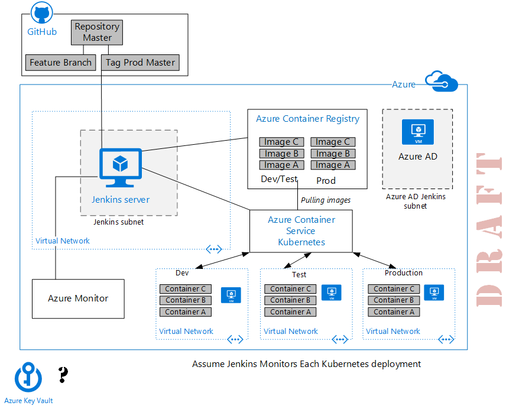
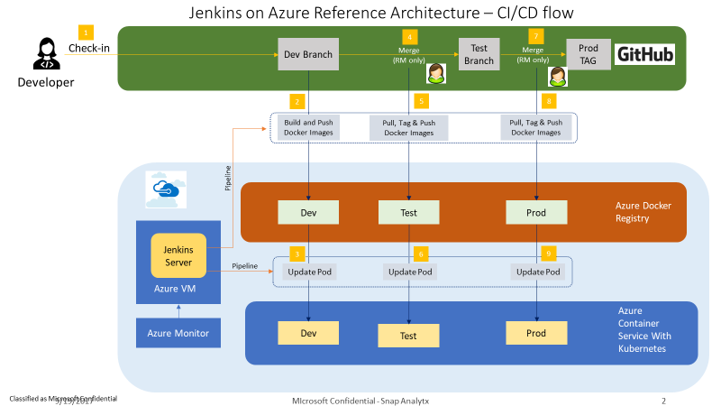
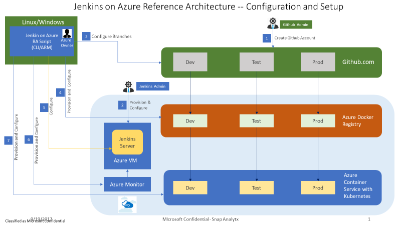

# Jenkins on Azure


This reference architecture shows how to use Jenkins to creates an end-to-end continuous integration and development (CI/CD) pipeline from GitHub to Azure. This reference architecture deploys a containerized sample application to a Kubernetes cluster on Azure. Jenkins is configured to automate builds in three stages, Dev, Test, and Prod.




Figure 1. Jenkins architecture.

NOTE: This reference architecture requires an Azure subscription and a GitHub account. These instructions assume that the Jenkins administrator is also the Azure administrator.

Architecture
============

This reference architecture includes a simple application that supports voting and stores the source code in a GitHub repository with three branches: Dev, Test, and Master. Jenkins is configured to build jobs from GitHub commits.

The architecture consists of the following components.

-   **GitHub**. A GitHub account is used for git source control of the application development environment. The repository master stores the source code for the sample voting application. Code updates are added to the Dev branch. A Jenkinsfile containing the definition of the pipeline is also checked into source control. A second GitHub repository stores the files used to deploy this reference architecture.

-   **Virtual network**. A [virtual network](https://docs.microsoft.com/en-us/azure/virtual-network/virtual-networks-overview) securely connects Azure resources to each other and provides logical isolation. In this architecture, the Jenkins server and the development, test, and production environments are each isolated within their own virtual network.

-   **Subnets**. The Jenkins server is isolated in a [subnet](https://docs.microsoft.com/en-us/azure/virtual-network/virtual-network-manage-subnet) to make it easier to manage and segregate network traffic without impacting performance.

-   **Jenkins server**. The latest stable version of the Jenkins automation software is installed on a Linux (Ubuntu 14.04 LTS) virtual machine on Azure.

-   **Azure Container Registry.** Provides a private registry for Docker container images. A Jenkins job takes an image of the sample application from the GitHub repository, puts it a Docker container in a Container Registry instance, and increments a version number.

-   **Azure Container Service for Kubernetes**. Creates clusters of virtual machines configured to run containerized applications. This reference architecture creates three Kubernetes clusters: Dev, Test, and Prod. A Jenkins job automates deployment of the latest version of an image in Container Registry to the appropriate cluster.

-   **Azure Storage.** Stores the Docker image version running in a cluster.

-   **Azure Active Directory (Azure AD)**. An Azure AD [service principal](https://docs.microsoft.com/en-us/azure/active-directory/develop/active-directory-application-objects)
    defines the policy and permissions for an owner role. Each service principal is associated with a Jenkins job.

-   **Azure Monitor**. Monitors the Azure virtual machine hosting Jenkins.

Workflow on Azure
=================

The following figure shows the CI/CD flow in this Jenkins reference  architecture. At each stage, code moves from one branch to another only after it has been tested and someone has signed off. Before code moves into next cycle in pipeline, Jenkins checks in and puts it in the right Docker container before sending it to the next place and deploying it to the right cluster.



1.  The workflow starts when a developer commits a code change to the Dev branch in GitHub and creates a pull request.

2.  This act triggers a Jenkins job that takes the code, creates a new Docker image, and pushes it into Azure Container Registry. The Jenkins job also increments the image number for version control and stores the number in the storage account for the Dev resource group.

3.  The Jenkins job puts the code into a Kubernetes cluster called Dev.

4.  The developer makes a pull request to the test branch, and the tester merges the change into the Test branch, which triggers a second Jenkins job.

5.  The second Jenkins job copies the image to a new Docker image called Test, and tags it with an incremental version number stored in the storage account for the Test resource group.

6.  The second Jenkins job puts the code into the Test cluster.

7.  The tester makes a pull request to the master branch, and a release manager merges the change to the master branch, which triggers the third Jenkins job.

8.  The third Jenkins job copies the image from the Test registry to the Prod registry.

9.  The Jenkins job pushes the image to the Prod cluster to complete the pipeline.

Building out CI/CD
------------------

This reference architecture builds the pipeline in several steps as the following figure shows.



The figure shows how the deployments is created:

1.  Create GitHub account

2.  Provision and configure Azure

3.  Provision branches in GitHub

4.  Provision and configure Azure Container Registry

5.  Configure Jenkins server

6.  Provision and configure Azure Monitor

7.  Provision and configure the Dev, Test, and Prod clusters in Kubernetes

Recommendations
===============

Your requirements might differ from the architecture described here. Use these recommendations as a starting point.

>   THIS SECTION UNDER CONSTRUCTION

Communities
===========

Communities can answer questions and help you set up a successful deployment. Consider the following:

-   [Jenkins Community Blog](https://jenkins.io/node/)

-   [Azure Forum](https://azure.microsoft.com/en-us/support/forums/)

-   [SAP Community](https://www.sap.com/community.html)

-   [Stack Overflow Jenkins](https://stackoverflow.com/tags/jenkins/info)

Solution deployment
===================

 There are three ways to deploy this reference architecture:

-   Windows computer that is connected remotely to a Linux virtual machine on Azure or another cloud, where all the Python scripts (joara commands) are run.

-   Windows computer or virtual machine

-   Linux computer or virtual machine

A deployment for this reference architecture is available on GitHub. It includes documentation in Markdown format as well as code artifacts for the deployment.

NOTE: The script for this reference architecture executes the deployment steps in sequence but does not track the state of the deployment. If an issue during deployment causes the script to fail, start over, first deleting all the Azure resources that were created by deleting the resource groups.

Prerequisites
-------------

Before deploying this reference architecture, make sure you have the following resources:

-   If you don’t already have one, create a GitHub account before continuing.

-   Miniconda for Python 3.6 for [Windows](https://conda.io/miniconda.html) or [Linux](https://repo.continuum.io/miniconda/Miniconda3-latest-Linux-x86_64.sh)

-   [PuTTY](http://www.chiark.greenend.org.uk/~sgtatham/putty/download.html) and PuTTYgen (installed with PuTTY)

-   [Kubectl](https://na01.safelinks.protection.outlook.com/?url=https%3A%2F%2Fkubernetes.io%2Fdocs%2Fuser-guide%2Fkubectl-overview%2F&data=02%7C01%7Cv-nanray%40microsoft.com%7Cab801216520747cc085d08d4fd1a3913%7C72f988bf86f141af91ab2d7cd011db47%7C1%7C0%7C636411736455319445&sdata=oegXDf6IUWuSSBrl6t5YzBiJZBb6Z60bZYuMlxTnG5E%3D&reserved=0) (Kubernetes command line)

Set up computer if using Windows
--------------------------------

This step installs an Anaconda window with Miniconda so you can run the Python (joara) commands for setting up Jenkins in an isolated environment.

1.  To install Miniconda for Python3.6, go to <https://conda.io/miniconda.html>. When the installation is complete, a command line window opens with the Anaconda prompt (cmd\>). If the window doesn’t open, look for a program named Anaconda Windows and open it.

2.  To create the virtual environment for Python programs, at the cmd\> prompt, run the following command. The name **vjoaraapp3** name is user-dependent—you can change it, but be consistent.

```
   conda create -n vjoaraapp3 python
```
3.  When prompted to proceed, type **y**, then wait a few minutes for the packages to be installed.

4.  To active the environment, at the cmd\> prompt, run:
```
   activate vjoaraapp3
```
   Do this every time you reactivate the Python environment.

Set up computer if using Linux
------------------------------

This step installs an Anaconda shell with Miniconda so you can run the Python (joara) commands for setting up Jenkins in an isolated environment.

1.  To install Miniconda, run the following commands:
```
   wget https://repo.continuum.io/miniconda/Miniconda3-latest-Linux-x86\_64.sh

   chmod +x Miniconda3-latest-Linux-x86\_64.sh

   ./Miniconda3-latest-Linux-x86\_64.sh

   export PATH=/home/\$USER/miniconda3/bin:\$PATH
```
2.  To create the virtual environment for Python programs, run:
```
   conda create -n vjoaraapp3 python
```
3.  When prompted to proceed, type **y**, then wait a few minutes for the
    packages to be installed.

4.  To active the environment, run:
```
   source activate vjoaraapp3
```
   Do this every time you reactivate the Python environment.

1. Clone joara-main repo and configure clusters.ini
---------------------------------------------------

The following steps clone the GitHub repository for this reference architecture and install pip, the package management system required by Python. The account is configured with webhooks for Jenkins. A repository is created for the sample application, anodejs. Three branches are created (dev, test, and master.)

1.  To create a joara-main repository on your GitHub account, clone joara-main from <https://github.com/Snap-Analytx/joara-main.git> and add it to your GitHub account.

2.  On your local computer, run the following commands. If Linux, run in the conda shell created earlier. If Windows, in the Anaconda window created earlier.
```
   git clone https://github.com/<yourrepository>/joara-main.git 
```
>   NOTE: In subsequent steps, you will edit the **clusters.ini** file. Make  sure to push this back up to your GitHub repository. Jenkins server looks for this **clusters.ini** file, so it needs to be in sync with your local copy.

3.  Edit the **clusters.ini** file based on information you get from GitHub and Azure as follows.

    1.  From GitHub, add the following three values:  
        GIT\_HUB\_ORG\_ID = [Your GitHub Org ID from Settings \> Organizations]  
        GIT\_HUB\_USER\_NAME = [GitHub User]  
        GIT\_HUB\_TOKEN = [Your GitHub token from Settings \> Personal Access
        tokens \> Generate new token]

    2.  From Azure, create a [service principal](https://blogs.msdn.microsoft.com/arsen/2016/05/11/how-to-create-and-test-azure-service-principal-using-azure-cli/) for an **owner** role, and add the following four values:  
        AZURE\_SUBSCRIPTION\_ID = [Your SubscriptionID from Azure service
        principal]  
        AZURE\_CLIENT\_ID = [Your AppId from Azure service principle]  
        AZURE\_CLIENT\_SECRET = [Your Password from Azure service principle]  
        AZURE\_TENANT\_ID = [Your Tenant from Azure service principle]

    3.  In **clusters.ini**, for RESOURCE\_GROUP\_PREFIX, enter a unique name that will be used as the prefix for the resource groups in Azure created by the joara-main app. NOTE: If the resource group name in your subscription is not unique, you'll get an error during deployment.

    4.  Push the **clusters.ini** file back to your joara-main GitHub repository.

4.  Build and install the joara-main app:
```
    cd joara-main

   pip install --editable joara-app-provision
```
5.  Verify that the following joara-main repository appears, containing these folders:

-   /Infrastructure: Provisioning of infrastructure ARM templates, configuring
    Jenkins and Docker images

-   /Infrastructure/provisioning: Provisioning of Azure resources
-   /Infrastructure/images\_version: Images version metadata
-   /Infrastructure/images: Docker images
-   /Infrastructure/configure: Jenkins configuration
-   joara-app-provision: Joara CLI

6.  To create the application repository in the user account:
```
   joara gitconfigure --group git --image anodejs --task all –verbose
```
7.  To create a webhook for the repo:
```
   joara gitconfigure --group git --image anodejs --task repohook --verbose
```
2. Provision Azure and bootstrap the Jenkins server
---------------------------------------------------

This step provisions the resources in Azure used for the pipeline. The **all** parameter creates ACS, ACR, and Storage for the Dev, Test, and Prod clusters. The **jenkins** parameter creates the virtual machine used for the Jenkins server.

1.  From the command shell on your Linux or Windows computer, run the following to configure the Azure resources:
```
   joara -d dev bootstrap --group all --verbose
   joara -d test bootstrap --group all --verbose
   joara -d prod bootstrap --group all --verbose
   joara -d jenkins bootstrap --group jenkins --verbose
```
2.  Wait about five minutes for the bootstrap to complete, then run the following pre-configuration command to get the password for connecting to the Jenkins server. If the command is not successful at first, wait a few more minutes, then try again.
```
   joara -d jenkins jenkinsconfigure --group pre-jenkins
```
3.  Copy the Jenkins Admin password that is displayed on the screen and save it in a secure location. You will need this later. It looks something like this: **2e877fc805c640f386e0510f7481185**

4.  To see the resources that have been created, sign on to [portal.azure.com](http://portal.azure.com), then click **Resource groups**. Note that the following Azure resource groups are created, one for each environment (where \<*your prefix*\> is the value you entered earlier in clusters.ini for RESOURCE\_GROUP\_PREFIX):

-   **\<your prefix\>-jenkins**, the Jenkins server based on the Jenkins build from the Azure Marketplace
-   **\<your prefix\>-dev**, the Dev cluster
-   **\<your prefix\>-test**, the Test cluster
-   **\<your prefix\>-prod**, the Production cluster

The resource groups for the Dev, Test, and Prod clusters are essentially identical. Each includes ACR for storing the Docker images, ACS for running Kubernetes, and a storage account used exclusively for keeping track of the Docker image version running in a cluster.

3. Configure Jenkins
--------------------

The Azure configuration creates a virtual machine in which a generic Jenkins server is running. The next step is to connect to the Jenkins web console and configure the Jenkins server, a two-step process where you:

-   Give Jenkins the credentials that enable the Jenkins jobs to access GitHub and the Azure resources.

-   Install the code for the Jenkins jobs.

### 3.1. Set up a secure tunnel

To connect to the Jenkins portal, you need the private key that was used to create Jenkins server. This key is created on the computer you used to issue the Jenkins configuration commands. If you are using a Linux machine, the private key is already available locally in the PPK format needed by [PuTTY](http://www.chiark.greenend.org.uk/~sgtatham/putty/download.html) to tunnel to the Jenkins server.

1.  **If using a Linux computer** to run this setup, do the following:

    1.  On the Linux VM, locate **/home/\<username\>/.ssh/id\_rsa**

    2.  Run:

>   [add command to run from linux machine to create tunnel]

2.  **If using a Windows computer** for this setup, do the following:

    1.  Create the certificates in **/User/\<username\>/.ssh/id\_rsa**.

    2.  To convert the private key file (rsa\_id) to PPK format, use PuTTYgen as
        shown in the following picture: Load the file rsa\_id, and save the file
        as **Jenkins.ppk** in the same folder as joara-main.

>   [./media/image4.png](./media/image4.png)

>   For more information, see [How to Use SSH keys with Windows on Azure](https://docs.microsoft.com/en-us/azure/virtual-machines/linux/ssh-from-windows).

3.  Create a secure SSH tunnel to the Jenkins server using one of the following methods:

    1.  Open PuTTY. In **PuTTY Configuration**, fill in the host name or IP address of the VM from the Azure portal. Click **Connection** \> **SSH** \> **Auth**. Browse to and select your private key. Click **Open** to connect to the virtual machine.

    2.  From the Anaconda window, run:
```
   c:\\temp\\putty.exe -ssh -i C:\\[where you have jora-main]\\jenkins.ppk -L 127.0.0.1:8080:localhost:8080 [YOUR RESOURCE GROUP PREFIX]jenkins\@[YOUR RESOURCE GROUP PREFIX]-release-jenkins.eastus.cloudapp.azure.com
```
4.  When a warning message appears, click **Yes** to accept the credentials. The PuTTY window opens, showing that you have an SSH connection to the VM on Azure that hosts the Jenkins server.

5.  **Do not close** the PuTTY window—keep this connection to the Jenkins server open.

### 3.2. Connect to Jenkins server and sign in

To complete the Jenkins configuration, next connect to Jenkins server through localhost:8080, using the tunnel just created from the local computer to the Jenkins server.

1.  Open a browser and go to <http://localhost:8080>/. The Jenkins **Getting Started** screen appears.

2.  Under **Unlock Jenkins** in the **Administrator password** box, paste the password retrieved in the previous step, then click **Continue**.

3.  On the **Customize Jenkins** screen, select **Install suggested plugins**, then wait for the plugins to be installed.

4.  On the **Create First Admin User** screen, create the username and password you want to use for the Jenkins server. Enter the remaining information, then click **Save and Finish**.

5.  When the setup is complete, click **Start Using Jenkins**. The Jenkins portal opens

6.  Switch to the Linux conda shell or Windows Anaconda cmd window, and run the following command, which installs the code that configures the Jenkins server and creates the three Jenkins jobs that automate the pipeline:
```
   joara -d jenkins jenkinsconfigure --group Jenkins --verbose
```
7.  Wait a few minutes for the script to configure the Jenkins jobs. When a success message appears, the Jenkins server configuration is complete.

### 3.3. Give Jenkins the credentials

Now that the Jenkins server is set up, use the Jenkins web console to create credentials that allow each Jenkins job to access Azure resources, and another set of credentials that allow jobs to access GitHub.

1.  On your local computer, open a browser, and go to <http://localhost:8080/>.

2.  Log on to the Jenkins Server console using the username and password you created in the previous step.

3.  Go to **Credentials** \> **{global}** \> **Add Credentials.**

4.  Do the following:

    1.  For **Kind**, choose **Microsoft Azure Service Principal**.
    2.  For **Scope**, choose **Global (Jenkins, nodes, child items, etc.)**.
    3.  For **Subscription ID**, copy the AZURE\_SUBSCRIPTION\_ID value from **clusters.ini** file.
    4.  For **Client ID**, copy the AZURE\_CLIENT\_ID value from **clusters.ini**.
    5.  For **Client Secret**, copy the AZURE\_CLIENT\_SECRET value from **clusters.ini**.
    6.  For **OAuth 2.0 Token Endpoint**, replace **\<TenantId\>** with the AZURE\_TENANT\_ID value from **clusters.ini**.
    7.  For **ID**, enter copy the JENKINS\_AZURE\_CREDENTIALS\_NAME value from **clusters.ini**.

5.  Click **Verify Service Principal**, and when verified, click **OK**. If a validation error occurs, make sure the IDs were entered correctly with no extra characters or spaces.

6.  To give Jenkins access to GitHub, go to **Global credentials** and choose **Add Credentials**.

7.  Do the following:

    1.  For **Kind**, choose **Username with password**.
    2.  For **Scope**, choose **Global (Jenkins, nodes, child items, etc.)**.
    3.  For **Username**, enter your GitHub username.
    4.  For **Password**, enter the value of GIT\_HUB\_TOKEN from clusters.ini.
    5.  For **ID**, enter the value of JENKINS\_GITHUB\_CREDENTIALS NAME from
        clusters.ini.

8.  Click **OK**. Notice that the **Global credentials** screen displays two credentials, one for Azure, one for GitHub.

9.  To set up access to the GitHub repository, on the toolbar, click **Jenkins**, then click **New Item**.

10. In the **Enter an item name** box, enter an organization name from your GitHub account (from **Settings** \> **Organizations**).

11. Click **GitHub Organization**, then click **OK**.

12. On the next screen, for **Credentials**, select the credential you created in step 7.

13. Leave the remaining default settings in place, and click **Save**.

Jenkins scans the entire repository and discovers whether any branches are associated with jobs. When the scan is finished, the configuration of the Jenkins server and this reference architecture is complete.

4. Test the sample application and Kubernetes clusters
------------------------------------------------------

To see how Jenkins works, make a change to the voting application in the Dev branch on GitHub, and submit a pull request.

That event triggers a Jenkins job to create a new Docker image of the application code, push it into Azure Container Registry for Dev, and increment the version number. The Jenkins job then puts the image on the Kubernetes Dev cluster, the first stage of the CI/CD pipeline.

To see the clusters, access the Kubernetes portal and log on to the cluster for an environment (either Dev, Test, or Prod.)

To access Kubernetes:

1.  Get config file from Kubernetes cluster head node to the local Linux machine. Run the following command on the Linux VM:
```
   scp  -o StrictHostKeyChecking=no -o UserKnownHostsFile=/dev/null -i   \~/.ssh/id\_rsa  joaraacsdev\@jora-acs-mgmt-dev.eastus.cloudapp.azure.com:.kube/config /tmp/
```
2.  Copy the config from Linux to local Windows PC using a file transfer program.

3.  In the local Window cmd shell, do the following:

>   \>SET KUBECONFIG=c:\\\<path to config file\>

>   \>C:\\temp\\kubectl proxy

>   You’ll see a message such as *Starting server on 127.0.0.1:8001.*

1.  To access Kubernetes, open a browser and go to
    [http://127.0.0.1:8001/api/v1/proxy/namespaces/kube-system/services/kubernetes-dashboard/\#!/deployment?namespace=default](https://na01.safelinks.protection.outlook.com/?url=http%3A%2F%2F127.0.0.1%3A8001%2Fapi%2Fv1%2Fproxy%2Fnamespaces%2Fkube-system%2Fservices%2Fkubernetes-dashboard%2F%23%2521%2Fdeployment%3Fnamespace%3Ddefault&data=02%7C01%7Cv-nanray%40microsoft.com%7Cab801216520747cc085d08d4fd1a3913%7C72f988bf86f141af91ab2d7cd011db47%7C1%7C0%7C636411736455319445&sdata=FiHcNP4%2FrRuTM%2BOiA51uC73nfY4seiKsM1F9U4co4s4%3D&reserved=0)

2.  In the Kubernetes portal, click the public IP for the deployment under **Services**.
